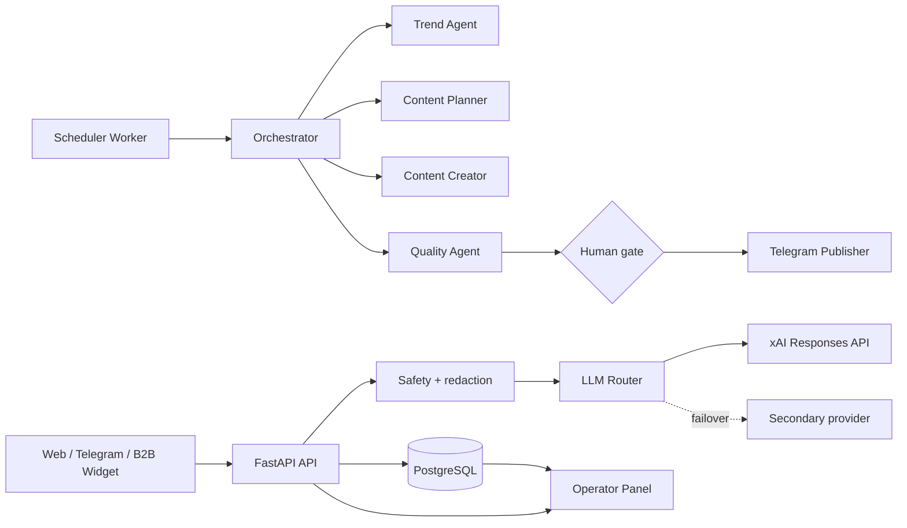

# 02. Архитектура

## 1. Выбранный подход

[РЕКОМЕНДАЦИЯ] Модульный монолит на Python/FastAPI, PostgreSQL, отдельный worker и Caddy. Это снижает стоимость поддержки и число точек отказа для одного оператора.

## 2. Почему не multi-agent framework

- жизненный цикл задач хранится в БД;
- дедупликация обеспечивается `dedup_key`;
- каждый агент имеет ограниченный вход и выход;
- публикация не передаётся LLM;
- LLM не получает прямой доступ к БД, платежам или токенам;
- восстановление возможно без чтения «памяти диалогов» между агентами.

## 3. Состояния контента

`draft → quality_review → ready_for_approval → approved → published`

Исключения:

- `needs_human_review`;
- `rejected`;
- `failed`.

## 4. LLM Router

Поддерживает основной и резервный провайдеры через Responses API. Для xAI включён `store=false`. В development доступен `mock`, позволяющий тестировать продукт и контентный конвейер без внешнего API.

## 5. Контроль затрат

- дневной бюджет;
- стоимость каждого поколения;
- бесплатный лимит на client ID;
- web search выключен по умолчанию;
- premium-режим не включается без entitlement;
- массовые фоновые генерации выполняются один раз в сутки.

## 6. Данные

Хранятся:

- client ID;
- режим, язык, цель, тон;
- редактированная версия контекста;
- результат;
- провайдер, модель, токены и стоимость;
- оценка и copy/share;
- контентная очередь;
- audit events.

Не хранятся по умолчанию:

- открытый исходный текст;
- контакты получателя;
- история переписки;
- платёжные реквизиты;
- секреты в БД.

## 7. Масштабирование

До устойчивых 100 000 генераций в месяц архитектуру не усложнять. При превышении:

1. вынести очередь в Redis/managed queue;
2. добавить object storage;
3. разнести public API и worker;
4. внедрить миграции Alembic;
5. добавить observability и SLO;
6. выделить платежный сервис.
